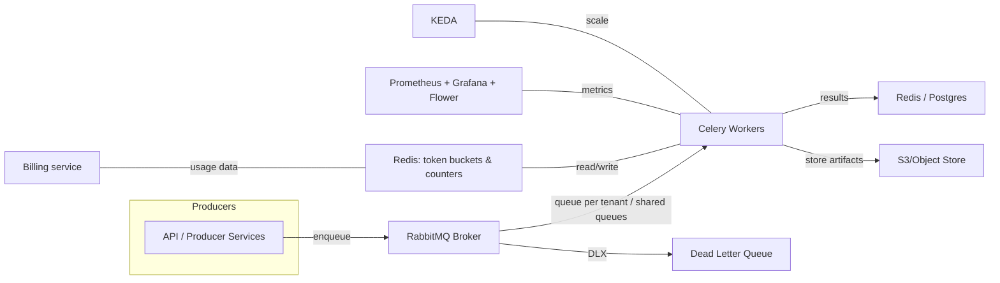
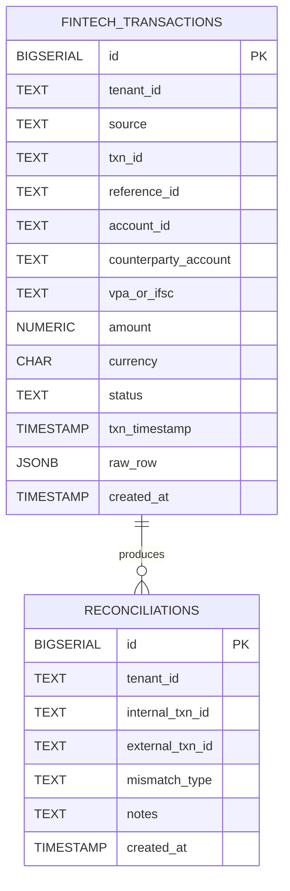

# distributed-task-queue
multi-tenant task queue with fair share allocation and priority




### Completed
1. API server
2. Celery Tasks and app setup
3. Rate limiting and quota
4. Logic for CSV and all task processing logic


### Inprogress
1.CI/CD pipeline and kubernetes deployment


### Running locally
run first time
```
docker compose up --build
```

remove

```
docker compose down

```

delete all images, networksand volumnes

```
sudo docker rmi -f xxx_id


sudo docker volume rm xxx_id


sudo docker network rm xxx_id

```
# Secrets
.env file with with DB parameters

# Dev Testing 
## API server 
```
curl -X POST http://localhost:8000/enqueue/ingest \
  -H "Content-Type: application/json" \
  -d '{
    "tenant_id": "t1",
    "s3_path": "upi_sample.csv",
    "source": "UPI"
  }'

``` 

# Database Doc 


## Schema 
```
    id BIGSERIAL PRIMARY KEY,
    tenant_id TEXT NOT NULL,
    source TEXT NOT NULL,
    txn_id TEXT NOT NULL,
    reference_id TEXT,
    account_id TEXT,
    counterparty_account TEXT,
    vpa_or_ifsc TEXT,
    amount NUMERIC(18,2) NOT NULL,
    currency CHAR(3) DEFAULT 'INR',
    status TEXT,
    txn_timestamp TIMESTAMP,
    raw_row JSONB,
    created_at TIMESTAMP DEFAULT NOW(),
    UNIQUE (tenant_id, txn_id)
```

## "fintech_transactions"

| Column                 | Description                                         |
| ---------------------- | --------------------------------------------------- |
| `id`                   | Internal surrogate primary key                      |
| `tenant_id`            | Tenant/customer identifier (multi-tenant isolation) |
| `source`               | Transaction source (UPI, IMPS, NEFT, SWIFT, etc.)   |
| `txn_id`               | Unique transaction ID from source system            |
| `reference_id`         | RRN / UTR / STAN depending on source                |
| `account_id`           | Sender account / payer identifier                   |
| `counterparty_account` | Receiver account / payee identifier                 |
| `vpa_or_ifsc`          | VPA (UPI) or IFSC (bank transfers)                  |
| `amount`               | Transaction amount                                  |
| `currency`             | ISO currency code (default: INR)                    |
| `status`               | SUCCESS / FAILED / PENDING                          |
| `txn_timestamp`        | Original transaction time                           |
| `raw_row`              | Full raw source record (JSONB)                      |
| `created_at`           | Ingestion timestamp                                 |

