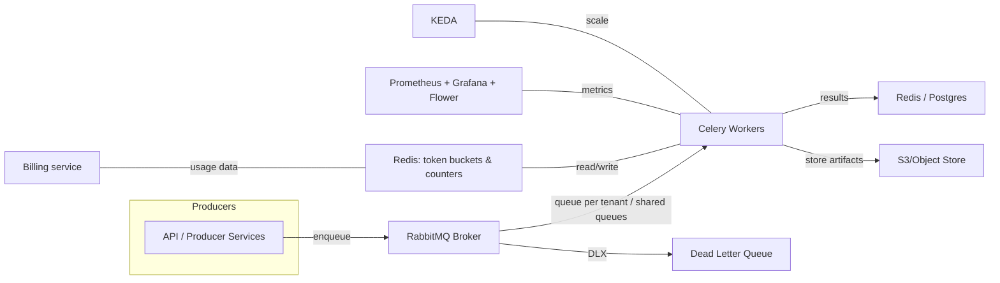

# distributed-task-queue
multi-tenant task queue with fair share allocation and priority




### Completed
1. API server
2. Celery Tasks and app setup
3. Rate limiting and quaota

### Inprogress
1. Logic for CSV and all task processing logic

### Running locally
run first time
```
docker compose up --build
```

remove

```
docker compose down

```

delete 

```
sudo docker rmi -f xxx_id


sudo docker volume rm xxx_id


sudo docker network rm xxx_id

```
