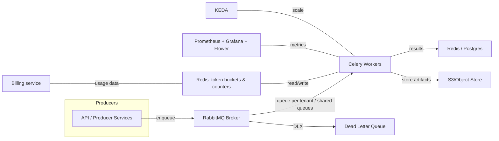

# distributed-task-queue
multi-tenant task queue with fair share allocation and priority

```mermaid
flowchart LR
  subgraph Producers
    P[API / Producer Services]
  end
  P -->|enqueue| Rabbit[RabbitMQ Broker]
  Rabbit -->|queue per tenant / shared queues| Workers[Celery Workers]
  Workers -->|results| RedisBackend[Redis / Postgres]
  Workers -->|store artifacts| S3[S3/Object Store]
  Rabbit -->|DLX| DLQ[Dead Letter Queue]
  RedisRate[Redis: token buckets & counters] ---|read/write| Workers
  Monitoring[Prometheus + Grafana + Flower] ---|metrics| Workers
  KEDA ---|scale| Workers
  Billing[Billing service] <---|usage data| RedisRate
```